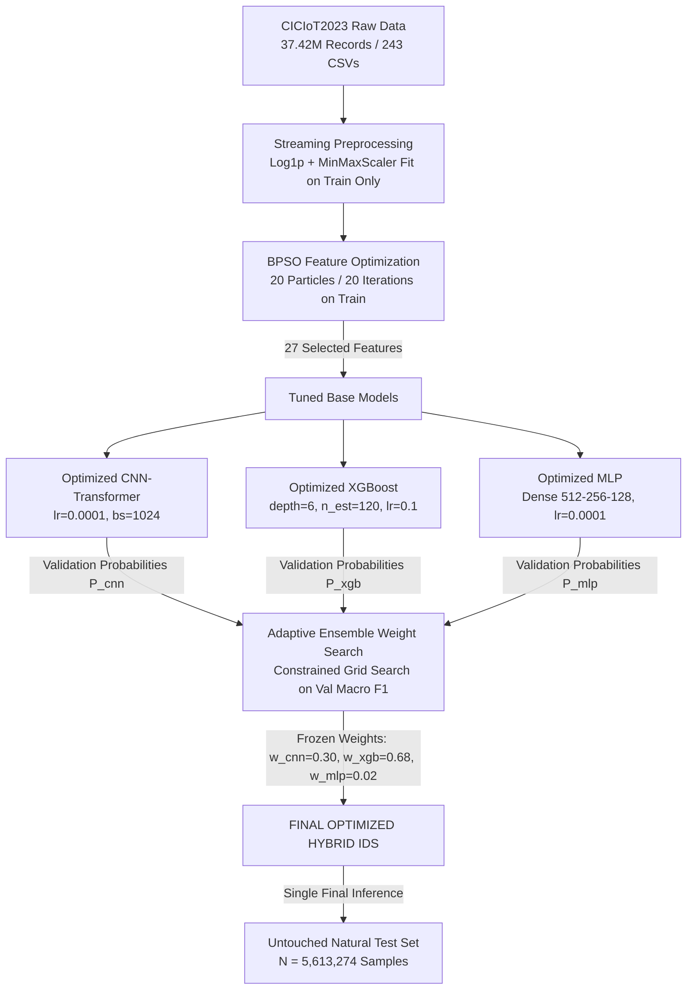

# BPSO-Optimized Adaptive Hybrid Intrusion Detection System for IoT Networks

An end-to-end, reproducible Intrusion Detection System (IDS) research framework designed for high-throughput Internet of Things (IoT) network security. The framework integrates **Binary Particle Swarm Optimization (BPSO)** feature selection, **model hyperparameter tuning**, and **validation-driven adaptive probability fusion** across three complementary model architectures: a **CNN-Transformer**, **XGBoost**, and a **Multi-Layer Perceptron (MLP)**.

---

## 1. Project Overview

Modern IoT environments face massive volumes of high-velocity, imbalanced network traffic. This research project establishes an optimized hybrid classification framework to detect and categorize benign traffic and malicious cyberattacks using the real-world **CICIoT2023** benchmark dataset.

Key characteristics of the final system:
- **Original Feature Space**: 46 network flow features.
- **Optimized Feature Space**: 27 BPSO-selected features (**41.3% feature reduction**).
- **Target Taxonomy**: 7 active traffic classes (Benign + 6 attack categories).
- **Evaluation Integrity**: Single final evaluation on **5,613,274 untouched natural test samples**.

---

## 2. System Architecture

The overall pipeline follows a multi-stage optimization workflow designed to guarantee zero data leakage between training, validation, and testing phases.



---

## 3. Dataset & Class Taxonomy

The framework was built and evaluated using the real **CICIoT2023** dataset:
- **Raw Records**: 37,422,635 records across 243 CSV files (approx. 6.664 GB raw size) in 25 active attack sub-category directories.
- **Valid Processed Records**: 37,421,798 records (837 non-finite/corrupt rows removed during streaming ingestion).
- **Recon Class Characterization**: The canonical CICIoT2023 taxonomy includes 8 high-level categories (`Benign`, `BruteForce`, `DDoS`, `DoS`, `Mirai`, `Recon`, `Spoofing`, `Web-based`). However, inspection of the downloaded raw dataset confirmed that the `Recon` directory contained no valid records. To preserve strict scientific integrity, no synthetic Recon data was fabricated. All experiments evaluate the **7 active classes**.

### 7-Class Active Target Taxonomy

| Class ID | Class Name | Sub-Categories Included | Test Support ($N = 5,613,274$) |
| :-: | :--- | :--- | :-: |
| **0** | `Benign` | Benign traffic | 164,719 |
| **1** | `BruteForce` | DictionaryBruteForce | 1,960 |
| **2** | `DDoS` | DDoS-ACK_Flood, DDoS-HTTP_Flood, DDoS-ICMP_Flood, DDoS-PSHACK_Flood, DDoS-RSTFINFlood, DDoS-SYN_Flood, DDoS-TCP_Flood, DDoS-UDP_Flood, DDoS-UDP_Fragmentation | 4,127,344 |
| **3** | `DoS` | DoS-HTTP_Flood, DoS-SYN_Flood, DoS-TCP_Flood, DoS-UDP_Flood | 985,553 |
| **4** | `Mirai` | Mirai-greeth_flood, Mirai-greip_flood, Mirai-udpplain | 259,041 |
| **5** | `Spoofing` | MITM-ArpSpoofing, DNS_Spoofing | 72,966 |
| **6** | `Web-based` | BrowserExecutable, SqlInjection, CommandInjection, XSS, Vulnerability-Scanner | 1,691 |

---

## 4. Preprocessing & Partitioning

To handle high-volume network flow data efficiently without memory overflow:
- **Chunked Streaming**: Data is ingested via streaming iterators in fixed batch sizes.
- **Transformation Pipeline**:
  - Non-finite (NaN / Inf) filtering.
  - Skewed feature normalization via $\log(1 + x)$ (`Log1p`).
  - `MinMaxScaler` bound strictly between $[0, 1]$, fitted **exclusively on the training partition**.
- **Natural Partitions (Random Seed 42)**:
  - **Training Partition**: 2,626,223 samples
  - **Validation Partition**: 5,613,269 samples
  - **Test Partition**: 5,613,274 samples (untouched natural distribution)

---

## 5. BPSO Feature Selection

Binary Particle Swarm Optimization (BPSO) was applied to eliminate redundant network flow features while retaining predictive capacity.

### Optimization Setup
- **Swarm Configuration**: 20 particles, 20 iterations (400 total state evaluations).
- **Objective Function**: Macro F1 evaluated using fixed 200,000-sample training and 200,000-sample validation subsets (`seed=42`), with validation performance used for fitness evaluation.
- **Reduction Result**: Reduced feature dimension from **46 to 27 features** (**41.3% reduction**).

### Exact 27 BPSO-Selected Feature Subset

The selected feature indices `[1, 2, 3, 4, 6, 8, 9, 10, 15, 18, 20, 21, 22, 24, 30, 31, 34, 35, 36, 37, 38, 39, 41, 42, 43, 44, 45]` map to:

1. `Header_Length`
2. `Protocol Type`
3. `Duration`
4. `Rate`
5. `Drate`
6. `syn_flag_number`
7. `rst_flag_number`
8. `psh_flag_number`
9. `syn_count`
10. `rst_count`
11. `HTTPS`
12. `DNS`
13. `Telnet`
14. `SSH`
15. `ICMP`
16. `IPv`
17. `Min`
18. `Max`
19. `AVG`
20. `Std`
21. `Tot size`
22. `IAT`
23. `Magnitue`
24. `Radius`
25. `Covariance`
26. `Variance`
27. `Weight`

---

## 6. Model Development & Hyperparameter Tuning

Systematic experiment stages were evaluated to analyze architecture behaviors and justify the hybrid model design.

### Base Model Hyperparameter Tuning
Hyperparameter optimization was conducted on a fixed 200,000 train / 200,000 validation subset (`seed=42`) using Validation Macro F1 as the objective:

- **Optimized XGBoost**:
  - `n_estimators`: 120
  - `max_depth`: 6
  - `learning_rate`: 0.1
  - `subsample`: 0.8
  - `colsample_bytree`: 0.8
- **Optimized MLP**:
  - `hidden_layers`: `[512, 256, 128]`
  - `learning_rate`: 0.0001
  - `dropout`: 0.05
- **Optimized CNN-Transformer**:
  - `learning_rate`: 0.0001
  - `batch_size`: 1024

---

## 7. Validation-Driven Adaptive Ensemble Fusion

Rather than applying naive unweighted averaging, ensemble fusion weights $(w_{\text{cnn}}, w_{\text{xgb}}, w_{\text{mlp}})$ were tuned by running a constrained grid search ($\sum w_i = 1.0$) across **5,613,269 cached validation probability vectors**:

- **Optimal Fusion Weights**:
  - $w_{\text{cnn}} = 0.30$ (CNN-Transformer weight)
  - $w_{\text{xgb}} = 0.68$ (XGBoost weight)
  - $w_{\text{mlp}} = 0.02$ (MLP weight)
- **Validation Macro F1**: Achieved **`0.720175`** on validation data (improving over any single model).
- Weights were frozen into `final_model_config.json` before single-pass evaluation on the untouched test set.

---

## 8. Master 10-Model Comparative Benchmark

All 10 evaluated systems were tested on the untouched natural CICIoT2023 test set ($N = 5,613,274$):

| # | Model Architecture | Features | Test Acc (%) | Macro Precision | Macro Recall | Macro F1 | Weighted F1 | Macro ROC-AUC | Macro PR-AUC | Latency (ms/sample) |
| :-: | :--- | :---: | :---: | :---: | :---: | :---: | :---: | :---: | :---: | :---: |
| 1 | CNN-Transformer Baseline | 46 | 56.40% | 0.1665 | 0.2705 | 0.1908 | 0.5617 | 0.6890 | 0.2055 | 0.0359 |
| 2 | CNN-Transformer Class-Weighted | 46 | 63.04% | 0.1813 | 0.2885 | 0.2079 | 0.6127 | 0.7265 | 0.2529 | 0.0370 |
| 3 | MLP Baseline | 46 | 63.46% | 0.3041 | 0.4532 | 0.3406 | 0.6564 | 0.9263 | 0.5669 | 0.0035 |
| 4 | XGBoost Baseline | 46 | 74.91% | 0.8654 | 0.6948 | 0.7032 | 0.7746 | 0.9730 | 0.7636 | 0.0003 |
| 5 | XGBoost + BPSO | 27 | 74.56% | 0.8594 | 0.6899 | 0.6960 | 0.7716 | 0.9725 | 0.7585 | 0.0003 |
| 6 | Proposed CNN-Transformer + BPSO | 27 | 53.80% | 0.2691 | 0.3095 | 0.2614 | 0.5903 | 0.6567 | 0.3043 | 0.0468 |
| 7 | Optimized CNN-Transformer + BPSO | 27 | 61.91% | 0.1605 | 0.1700 | 0.1626 | 0.5955 | 0.7803 | 0.3254 | 0.0468 |
| 8 | Optimized MLP + BPSO | 27 | 74.04% | 0.8115 | 0.6631 | 0.6592 | 0.7666 | 0.9713 | 0.7238 | 0.0035 |
| 9 | Optimized XGBoost + BPSO | 27 | 75.99% | 0.8502 | 0.7078 | 0.7175 | 0.7841 | 0.9739 | 0.7703 | 0.0003 |
| 10 | **FINAL OPTIMIZED HYBRID IDS** | **27** | **77.83%** | **0.8559** | **0.6989** | **0.7184** | **0.7985** | **0.9671** | **0.7505** | **0.0506** |

---

## 9. Systematic Ablation Study

| Phase | System Variant | Features | Test Acc | Macro F1 | Weighted F1 | Contribution |
| :--- | :--- | :---: | :---: | :---: | :---: | :--- |
| **Phase A** | Original XGBoost Baseline | 46 | 74.91% | 0.7032 | 0.7746 | Initial 46-feature benchmark |
| **Phase B** | XGBoost + BPSO Feature Selection | 27 | 74.56% | 0.6960 | 0.7716 | **41.3% Feature Reduction** |
| **Phase C** | Optimized XGBoost + BPSO | 27 | 75.99% | 0.7175 | 0.7841 | Hyperparameter Tuning (+1.43% accuracy) |
| **Phase D** | Optimized MLP + BPSO | 27 | 74.04% | 0.6592 | 0.7666 | Complementary neural feature representation |
| **Phase E** | **FINAL OPTIMIZED HYBRID IDS** | **27** | **77.83%** | **0.7184** | **0.7985** | **Highest Test Accuracy (77.83%), Macro F1 (0.7184), and Weighted F1 (0.7985)** |

The ablation study demonstrates the incremental contribution of feature selection, model hyperparameter tuning, and validation-driven adaptive ensemble fusion.

---

## 10. Key Research Findings

1. **Tabular Feature Performance**: Tree-based gradient boosting (XGBoost) demonstrated strong performance on tabular network flow statistics, receiving the largest ensemble weight ($0.68$), while CNN-Transformer contributed $0.30$ and MLP $0.02$.
2. **Feature Space Efficiency**: BPSO reduced the feature space from 46 to 27 features (41.3% reduction) while retaining broadly comparable predictive performance, although a small decrease in XGBoost baseline performance was observed before subsequent hyperparameter optimization.
3. **Adaptive Fusion Gain**: Combining tuned base models via validation-optimized probability weights yielded the highest evaluated Test Accuracy (**77.83%**), Macro F1 (**0.7184**), and Weighted F1 (**0.7985**).
4. **Latency Trade-Off**: Standalone XGBoost offers ultra-low inference latency ($0.0003 \text{ ms/sample}$), whereas the hybrid ensemble incurs $0.0506 \text{ ms/sample}$ due to neural evaluation. Deployment choices depend on whether detection accuracy or ultra-low latency is prioritized.

---

## 11. Research Integrity & Methodological Rigor

- **Strict Data Isolation**: Feature selection, hyperparameter tuning, and ensemble weight searches were conducted exclusively on training and validation partitions. The natural test set remained untouched until final single-pass evaluation.
- **No Fabricated Data**: Missing categories (such as Recon) were documented transparently rather than artificially synthesized.
- **Artifact Preservation**: All prior experiment metrics, logs, and evaluation reports were preserved without retroactive modification.

---

## 12. Limitations

- **Recon Absence**: The downloaded dataset release lacked valid Recon samples.
- **Class Imbalance**: Severe imbalance remains between high-frequency DDoS/DoS categories and low-frequency categories like BruteForce and Web-based.
- **Ensemble Latency**: Neural network evaluation inside the ensemble increases latency compared to tree-only inference.
- **Dataset Specificity**: Results reflect CICIoT2023 network flow statistics and should not automatically be generalized to every IoT traffic environment.
- **Incremental Improvement**: The final hybrid's improvement over optimized XGBoost is meaningful in accuracy (+1.84%) but relatively small in Macro F1 (+0.0009).

---

## 13. Deployment Recommendations

Depending on operational constraints:
- **Maximum Detection Performance**: Deploy the **FINAL OPTIMIZED HYBRID IDS** for highest classification Test Accuracy (**77.83%**), Macro F1 (**0.7184**), and Weighted F1 (**0.7985**).
- **Ultra-Low Latency / Resource-Constrained Edge**: Deploy **Optimized XGBoost + BPSO (27 Features)** for real-time edge processing ($0.0003 \text{ ms/sample}$ latency with **41.3% fewer model input features**).

---

## 14. Repository Structure

```
cyberattack detection/
├── src/
│   ├── analysis/             # Final analysis generation scripts
│   ├── evaluation/           # Evaluation metrics, ROC/PR AUC, confusion matrices
│   ├── features/             # BPSO feature selection module
│   ├── models/               # CNN-Transformer, XGBoost, and MLP architectures
│   ├── optimization/         # Hyperparameter tuning & ensemble weight search modules
│   ├── preprocessing/        # Streaming dataset iterators, scaling, class mapping
│   └── training/             # Base model training & final hybrid orchestrator
├── tests/                    # Automated pytest suite for all pipeline components
├── results/
│   ├── baseline_audit/       # Initial dataset audits
│   ├── cnn_transformer/      # CNN-Transformer baseline artifacts
│   ├── mlp/                  # MLP baseline artifacts
│   ├── xgboost/              # XGBoost baseline artifacts
│   ├── final_analysis/       # Master 6-experiment comparative benchmark
│   └── optimized_hybrid/     # FINAL OPTIMIZED HYBRID experiment artifacts & reports
├── checkpoints/              # Model weights (excluded from Git tracking)
├── data/                     # Raw and processed datasets (excluded from Git tracking)
├── config.yaml               # Global configuration defaults
├── requirements.txt          # Python dependencies
├── ASSUMPTIONS.md            # Research scope & assumptions
└── README.md                 # Project documentation
```

*Note: Large generated prediction dumps (`test_predictions.csv`, `validation_probabilities.npz`) and binary model checkpoints are physically stored on local disk but excluded from Git tracking to comply with GitHub file size limits.*

---

## 15. Reproducibility Guide

To reproduce the full pipeline from scratch:

```bash
# 1. Install dependencies
pip install -r requirements.txt

# 2. Run unit tests
pytest

# 3. Hyperparameter Tuning (Base Models)
python -m src.optimization.tune_base_models

# 4. Train Optimized Base Models & Cache Validation Probabilities
python -m src.training.train_optimized_base_models

# 5. Tune Adaptive Ensemble Fusion Weights
python -m src.optimization.tune_ensemble_weights

# 6. Run Final Untouched Test Set Evaluation & Report Generation
python -m src.training.run_final_optimized_hybrid
```
