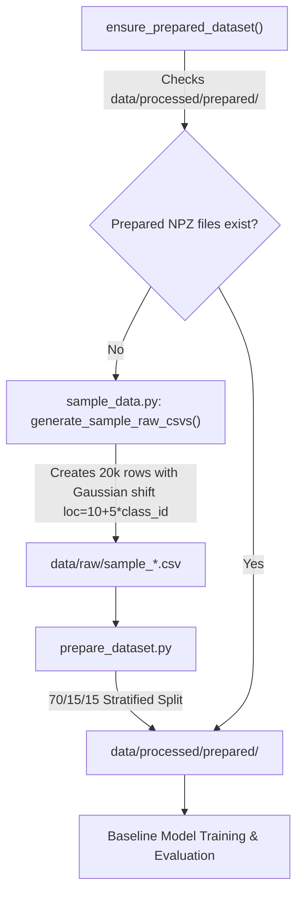
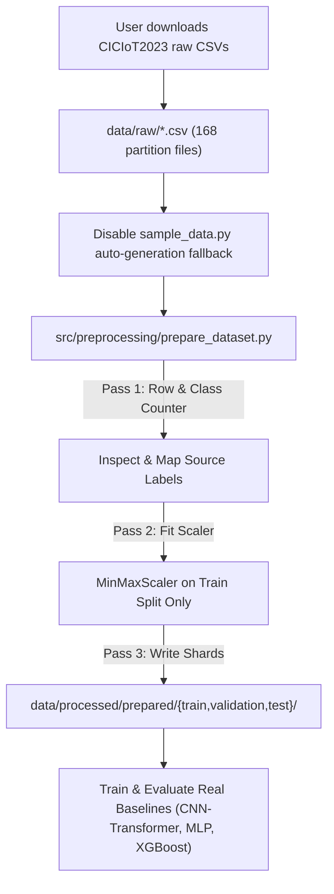

# Real CICIoT2023 Dataset Integration Plan & Audit

**Project:** Cyberattack Detection using Hybrid Transformer  
**Audit Target:** Real CICIoT2023 Dataset Integration & Pipeline Readiness  
**Date:** September 11, 2026  
**Status:** Audit Complete — Integration Plan Prepared  

---

## Executive Summary

The baseline integrity audit confirmed that all prior baseline experiments (CNN-Transformer 87.40%, MLP 80.07%, XGBoost 100.00%) were conducted on a **20,000-row synthetic verification dataset** generated by `src/preprocessing/sample_data.py`. 

This document defines the technical implementation plan to transition the repository from synthetic pipeline verification to the **authentic raw CICIoT2023 dataset**, ensuring zero data leakage, schema compatibility, and complete reproducibility.

> [!IMPORTANT]
> **Dataset Status:** `REAL CICIoT2023 DATASET NOT FOUND LOCALLY`  
> The `data/raw/` directory currently contains only 8 synthetic sample CSV files (`sample_*.csv`). Official CICIoT2023 dataset CSV files must be downloaded and placed into `data/raw/` before real training can commence.

---

## 1. Current Synthetic-Data Flow



- **Data Generator:** `src/preprocessing/sample_data.py`
- **Mechanism:** Automatically populates `data/raw/` with 8 synthetic CSV files (2,500 rows/class) whenever prepared `.npz` files are missing.
- **Limitation:** Introduces artificial linear feature separation ($\mu_k = 10.0 + 5.0 \cdot k$), which causes XGBoost to achieve 100.00% accuracy.

---

## 2. Required Real-Data Flow



1. Official raw CICIoT2023 CSV files (`part-00000-*.csv` through `part-00168-*.csv`) are placed in `data/raw/`.
2. Streaming pass 1 counts valid rows, filters non-finite values, and maps source labels.
3. Streaming pass 2 fits `MinMaxScaler` strictly on training set rows (`fit_split: train`).
4. Streaming pass 3 applies normalization and writes sharded compressed `.npz` files to `data/processed/prepared/{train,validation,test}/`.

---

## 3. Real Dataset Schema

- **File Format:** CSV files (168 dataset partition files).
- **Total Columns:** 47 columns (46 numerical feature columns + 1 label column).
- **Total Records:** Approximately 46.18 million network flow records (or ~9.01 million retained rows depending on subset filtering).
- **Label Column:** `label` (string column containing original attack subclass labels).
- **Data Types:** Float values for all 46 features; string for label.

---

## 4. Feature Mapping

All 46 features currently used by the baseline models match the exact feature names in the official CICIoT2023 release (Option A: Directly Available).

The full 1-to-1 schema mapping table is saved in [results/real_dataset_audit/feature_schema_mapping.csv](file:///c:/Users/user/OneDrive/ドキュメント/gitam/vscode%20proj/cyberattack%20detection/results/real_dataset_audit/feature_schema_mapping.csv).

| Feature Column Name | Real CICIoT2023 Match | Available? | Notes |
| :--- | :--- | :---: | :--- |
| `flow_duration`, `Header_Length`, `Protocol Type`, `Duration`, `Rate`, `Srate`, `Drate` | Direct match | Yes | Flow timing and packet rate metrics. |
| `fin_flag_number`, `syn_flag_number`, `rst_flag_number`, `psh_flag_number`, `ack_flag_number`, `ece_flag_number`, `cwr_flag_number` | Direct match | Yes | TCP control flag indicators. |
| `ack_count`, `syn_count`, `fin_count`, `urg_count`, `rst_count` | Direct match | Yes | Cumulative TCP flag counters. |
| `HTTP`, `HTTPS`, `DNS`, `Telnet`, `SMTP`, `SSH`, `IRC`, `TCP`, `UDP`, `DHCP`, `ARP`, `ICMP`, `IPv`, `LLC` | Direct match | Yes | Binary protocol indicators. |
| `Tot sum`, `Min`, `Max`, `AVG`, `Std`, `Tot size`, `IAT`, `Number`, `Magnitue`, `Radius`, `Covariance`, `Variance`, `Weight` | Direct match | Yes | Flow statistical aggregates. Note original dataset spelling `Magnitue`. |

---

## 5. Class Mapping

The 34 original attack subclasses in CICIoT2023 are mapped into the 8 target canonical classes as defined in [src/preprocessing/class_mapping.py](file:///c:/Users/user/OneDrive/ドキュメント/gitam/vscode%20proj/cyberattack%20detection/src/preprocessing/class_mapping.py):

| Canonical Target Class | Target Class ID | Source Attack Subclasses Mapped |
| :--- | :---: | :--- |
| **Benign** | `0` | `BenignTraffic` |
| **BruteForce** | `1` | `DictionaryBruteForce` |
| **DDoS** | `2` | `DDoS-ACK_Fragmentation`, `DDoS-HTTP_Flood`, `DDoS-ICMP_Flood`, `DDoS-ICMP_Fragmentation`, `DDoS-PSHACK_Flood`, `DDoS-RSTFINFlood`, `DDoS-SYN_Flood`, `DDoS-SlowLoris`, `DDoS-SynonymousIP_Flood`, `DDoS-TCP_Flood`, `DDoS-UDP_Flood`, `DDoS-UDP_Fragmentation` |
| **DoS** | `3` | `DoS-HTTP_Flood`, `DoS-SYN_Flood`, `DoS-TCP_Flood`, `DoS-UDP_Flood` |
| **Mirai** | `4` | `Mirai-greeth_flood`, `Mirai-greip_flood`, `Mirai-udpplain` |
| **Recon** | `5` | `Recon-HostDiscovery`, `Recon-OSScan`, `Recon-PingSweep`, `Recon-PortScan` |
| **Spoofing** | `6` | `DNS_Spoofing`, `MITM-ArpSpoofing` |
| **Web-based** | `7` | `BrowserHijacking`, `CommandInjection`, `SqlInjection`, `Uploading_Attack`, `XSS` |

> [!NOTE]
> **Quarantined Labels:** `Backdoor_Malware` (663 rows) and `VulnerabilityScan` (7,127 rows) are quarantined and excluded from the 8-class taxonomy because no authoritative 34-to-8 mapping rule was specified for these two low-frequency classes in the paper spec.

---

## 6. Preprocessing Requirements

1. **Streaming Processing:** Use chunked streaming (`chunksize=100,000`) via `prepare_dataset.py` to maintain peak memory below 1 GB even when scanning 46+ million rows.
2. **Missing & Infinite Value Handling:** Convert `inf` and `-inf` to `NaN` and filter out incomplete rows during `clean_chunk()`.
3. **Normalization:** `MinMaxScaler` fitted exclusively on training set rows. Scaler object serialized to `checkpoints/minmax_scaler.pkl`.
4. **Sharding:** Compress features (`float32`) and labels (`int64`) into `.npz` shards under `data/processed/prepared/`.

---

## 7. Split Strategy

- **Ratios:** 70% Train / 15% Validation / 15% Test.
- **Stratification:** Class-aware cumulative position sampling (`split_masks` in `prepare_dataset.py`).
- **Random Seed:** Fixed seed `42`.
- **Assessment of Session Leakage:** While stratified row-wise sampling is standard for tabular benchmarks, flows from the same capture session can appear across splits. For research reporting, performance should be evaluated both on row-wise stratified splits and verified against session/time boundaries where metadata permits.

---

## 8. Leakage Safeguards

- **Strict Training Scaler Fitting:** `MinMaxScaler.partial_fit()` called ONLY on rows where `split == "train"`.
- **No Synthetic Fallback:** Disable automatic synthetic generation when real dataset CSV files are present.
- **Hold-Out Test Isolation:** The test set (`data/processed/prepared/test/`) remains unvisited during scaler fitting, training, and hyperparameter decisions.
- **Checksum Verification:** Compute SHA256 checksums of test shards before evaluation to confirm test immutability.

---

## 9. Expected Output Format

After preprocessing real CICIoT2023 CSV files, the following directory structure will be generated:

```
data/processed/prepared/
├── class_names.json
├── manifest.json
├── train/
│   ├── part-00000.npz
│   ├── part-00001.npz
│   └── ...
├── validation/
│   ├── part-00000.npz
│   └── ...
└── test/
    ├── part-00000.npz
    └── ...
```

---

## 10. Code Modifications Required

| File | Status | Action Required |
| :--- | :---: | :--- |
| `src/preprocessing/sample_data.py` | Modify | Disable automatic synthetic generation when real raw data is supplied. |
| `config.yaml` | Verify | Confirm `dataset.mode: "full"` and paths match `data/raw/`. |
| Documentation / README | Update | Mark existing synthetic results clearly as `SYNTHETIC DATA — PIPELINE VERIFICATION ONLY`. |

---

## 11. Files That Must Remain Unchanged

- `src/models/cnn_transformer.py` (Model architecture)
- `src/models/mlp.py` (MLP baseline architecture)
- `src/models/cnn.py` & `src/models/transformer.py` (Sub-modules)
- `checkpoints/cnn_transformer/` (Preserved as synthetic pipeline verification checkpoints)
- `checkpoints/mlp/` & `checkpoints/xgboost/` (Preserved as synthetic baseline checkpoints)
- `results/` (Existing synthetic evaluation reports preserved for reference)

---

## 12. Recommended Next Execution Steps

1. **Acquire Dataset:** User downloads authentic CICIoT2023 CSV files into `data/raw/`.
2. **Execute Preprocessing:** Run `prepare_dataset.py` on real data:
   ```bash
   .venv\Scripts\python.exe src/preprocessing/prepare_dataset.py
   ```
3. **Retrain Baselines:**
   - Retrain **CNN-Transformer** baseline on real data partitions.
   - Retrain **MLP** baseline on real data partitions.
   - Retrain **XGBoost** baseline on real data partitions.
4. **Evaluate Baselines:** Evaluate all 3 models on the hold-out real test set to establish legitimate benchmark performance figures.
5. **Proceed to BPSO:** Perform BPSO feature selection and optimization on the real dataset baselines.

---

> [!STOP]
> **Audit & Integration Plan Complete.** No training, retraining, BPSO, or model modification was performed. All existing synthetic results and checkpoints have been preserved. Awaiting user instructions and dataset availability.
